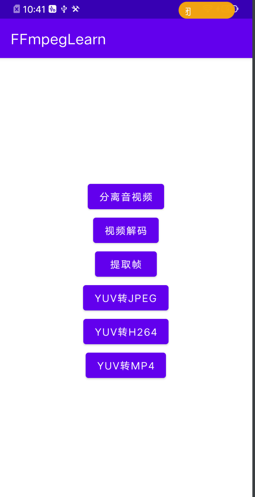

# FFmpegLearn

FFmpeg 学习代码，主要参照雷神的博客[(leixiaohua1020)的专栏](https://blog.csdn.net/leixiaohua1020) 以及 FFmpeg[FFmpeg示例子程序](https://github.com/FFmpeg/FFmpeg/tree/master/doc/examples)

## 已经实现了以下代码

0、分离Mp4文件为YUV和PCM

1、实现H264文件解码,并每帧保存为PGM图像

2、提取视频每个 AVFrame

3、实现 YUV 格式转 JPEG

4、实现 YUV 格式转 H264

5、实现 YUV 格式转 MP4

## 运行图

